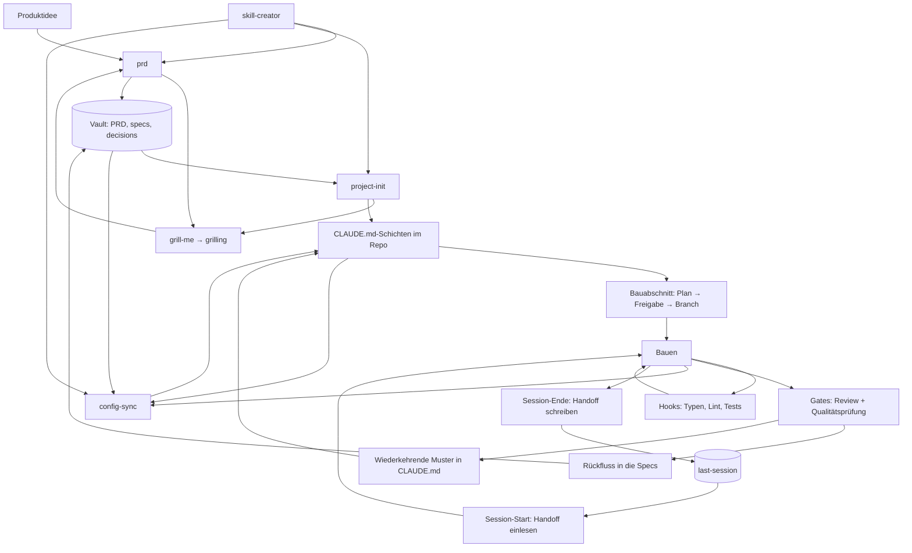

# Der Kreislauf

Wie die Skills zusammenspielen: was wann läuft, was es liest, was es hinterlässt.

Dieses Dokument beschreibt den Mechanismus. Was im Baukasten liegt und wie man es installiert, steht im [README](README.md).

---

## Das Fundament

Ein Projekt hat drei Arten von Wahrheit, und sie altern unterschiedlich schnell.

**Produktwahrheit** (was wir bauen und warum) ändert sich selten und liegt **außerhalb des Repos** im Vault. Nicht an einen Branch gebunden, nicht kopierbar, genau ein Exemplar.

**Arbeitskonventionen** (wie wir hier bauen) ändern sich mit dem Stack und liegen **in der Versionsverwaltung**, direkt neben dem Code, für den sie gelten.

**Ist-Stand** (was der Code heute tatsächlich tut) ist nur verlässlich, wenn er **aus dem Code** gelesen wird. Konfiguration darf ihn nie ohne Beleg behaupten.

Wer diese drei vermischt, bekommt Dokumentation, die verrottet. Sie zu trennen ist der ganze Zweck.

---

## Übersicht

---

## Einmalig, beim Projektstart

### 1. Wissensbasis anlegen

**Skill:** `project-init`, Phase 0

Vor allem anderen. Das PRD braucht einen Ort, der nicht das Repo ist. Prüft, ob ein Obsidian-MCP verfügbar ist, führt sonst durch die Einrichtung, und legt die Vault-Struktur an: `PRD.md`, `roadmap.md`, `specs/_index.md`, `specs/decisions/`.

Der Grund für die Reihenfolge: Produktwahrheit im Repo ist eine Falle. Sie hängt an einem Branch, wird irgendwann der Bequemlichkeit halber ein zweites Mal abgelegt, und ein halbes Jahr später widersprechen sich zwei Fassungen und niemand weiß, welche gilt.

### 2. Produkt spezifizieren

**Skill:** `prd`, der `grill-me` aufruft, das wiederum `grilling` ausführt

Kein PRD ohne Interview. `grilling` arbeitet einen Entscheidungsbaum in Runden ab: pro Runde alle Fragen, deren Voraussetzungen geklärt sind, jeweils mit einer Empfehlung. Fakten beschafft der Agent selbst, Entscheidungen trifft der Nutzer. Fertig ist es, wenn keine offene Verzweigung mehr übrig ist.

Ohne dieses Interview wird ein PRD zu dem, was der Skill selbst „aspirational fiction" nennt: plausibel klingende Absichten ohne belastbare Aussage.

**Ergebnis:** PRD im Vault. Nicht im Repo.

### 3. Konfiguration aufbauen

**Skill:** `project-init`, Phasen 1 bis 5

Liest das PRD, führt ein **eigenes** Interview über den Stack, leitet daraus die Bereichskarte ab, legt einen Plan vor und schreibt erst nach Freigabe.

Warum Stack und Produkt getrennt erfragt werden: Das PRD sagt nichts über die Technik und markiert einen unbestimmten Stack selbst als `TBD`. Regeln für einen Stack, den niemand gewählt hat, lesen sich wie richtige Regeln und werden befolgt. Nur bestätigte Technologie erzeugt technische Regeln, alles andere bleibt `TBD` mit dem Hinweis, was es klären würde.

**Ergebnis:** Wurzel-`CLAUDE.md`, Bereichs-`CLAUDE.md` je Bereich, `.claude/references/`, und die Wissensbasis-Tabelle, die auf den Vault zeigt.

---

## Je Bauabschnitt

### 4. Planen, freigeben, abzweigen

Erst Planungsmodus, dann Plandatei, dann Eintrag im Fahrplan, dann Freigabe, dann Branch. In dieser Reihenfolge. Es wird nichts angefasst, bevor der Plan freigegeben ist, auch der Branch existiert vorher nicht.

Entscheidungen, die während des Bauens fallen, wandern **sofort** in den Entscheidungsabschnitt der Plandatei, nicht am Ende. Was am Ende nachgetragen wird, ist Rekonstruktion und nicht Protokoll.

### 5. Bauen mit Sofortprüfung

**Mechanismus:** Hooks nach jeder Dateiänderung

Typprüfung und Linter laufen nach jedem Edit, Tests laufen, wenn der geänderte Pfad welche hat. Das Ergebnis landet im selben Arbeitsschritt, nicht in einem Durchlauf danach. Ein Fehler, der sofort zurückkommt, kostet einen Gedanken. Derselbe Fehler zwanzig Änderungen später kostet eine Suche.

### 6. Abschluss-Gates

Am Ende eines Abschnitts, in fester Reihenfolge: Checkliste, Tests grün, Änderungsreview, Wartbarkeitsreview, Bericht. Die beiden Reviews sind **getrennte** Gates. Ein sauberes Änderungsreview sagt nichts darüber, ob der Code in sechs Monaten noch zu ändern ist.

Push erst nach ausdrücklicher Freigabe.

### 7. Rückfluss

Was gebaut wurde, wird in die Specs nachgezogen. Muster, die im Review **zweimal** aufgetaucht sind, wandern in den Abschnitt für bekannte Schwachstellen der Wurzel-`CLAUDE.md`.

Das ist die Stelle, an der aus einem Fehler eine Regel wird. Ohne sie wiederholt sich derselbe Fehler, bis jemand ihn zufällig erinnert.

---

## Je Session

### 8. Übergabe

Am Ende einer Sitzung wird ein Handoff geschrieben, beim Start der nächsten wieder eingelesen. Ausgelöst wird das über Abschiedsphrasen, nicht über einen Befehl, den man sich merken muss.

Der Handoff ist konkret oder wertlos: Branch, Commit-Bereich, Testzahl, was als Nächstes ansteht und in welcher Reihenfolge. „Wir haben an X gearbeitet" hilft niemandem.

---

## Laufend

### 9. Konfiguration gegen die Wirklichkeit

**Skill:** `config-sync` *(fehlt noch, siehe unten)*

Prüft die Konfiguration gegen ihre jeweilige Autorität und zieht Abweichungen nach. Die Zuständigkeit hängt von der Art der Aussage ab:

| Art der Aussage | Zuständig |
|---|---|
| Ist-Stand: „die Funktion heißt X", „das Feld existiert" | **Der Code.** Nachsehen, nie erinnern |
| Entscheidung: „wir nutzen Y nicht mehr" | **Die Entscheidungsdokumente** |
| Produkt: Zielgruppe, Umfang, bewusste Nicht-Ziele | **Das PRD** |

Die Prüffrage, wenn unklar ist, welche Autorität greift: *Könnte ich das durch Hinschauen im Repo widerlegen?* Wenn ja, ist es Ist-Stand, und der Code entscheidet.

Dieser Schritt schließt den Kreis. Ohne ihn ist alles davor eine Einbahnstraße: Konfiguration entsteht einmal und driftet danach still von dem weg, was tatsächlich gebaut wurde.

### 10. Werkzeuge verbessern

**Skill:** `skill-creator`

Baut neue Skills, verbessert bestehende, misst Trefferquote der Auslöser. Das Werkzeug, mit dem der Baukasten sich selbst erweitert.

---

## Zwei Regeln über allem

**Eine Wahrheit, ein Ort.** Keine Aussage steht in zwei Dateien. Wo eine zweite sie braucht, verweist sie. Zwei Kopien einer Regel werden irgendwann uneins, und dann folgt die Arbeit der falschen.

**Bestand mit Ablaufdatum.** Was noch läuft, aber abgelöst wird, sagt das in seinem eigenen Dokument: was heute gilt, was es ersetzt, welche Entscheidung das festgelegt hat, und worauf nicht mehr aufgebaut werden darf. Dokumentation, die ein sterbendes System als Zielbild beschreibt, bringt jeder Sitzung still das Falsche bei.

---

## Stand des Baukastens

Ehrlich, weil ein Kreislauf mit Lücke kein Kreislauf ist.

| Baustein | Zweck | Stand |
|---|---|---|
| `prd` | Produkt spezifizieren | vorhanden |
| `grill-me` → `grilling` | Interview-Verfahren | vorhanden |
| `project-init` | Konfiguration aufbauen | vorhanden |
| `skill-creator` | Skills bauen und messen | vorhanden |
| `config-sync` | Konfiguration gegen Code korrigieren | **fehlt** |
| Session-Übergabe | Handoff schreiben und einlesen | **fehlt** |
| Änderungsreview | Gate vor dem Commit | **fehlt** |
| Projektstand | offene Arbeit beantworten | **fehlt** |
| Hooks | Sofortprüfung, Phrasen-Routing | **fehlt** |

Was heute steht, trägt die Schritte 1 bis 3: von der Idee zum Gerüst. Alles danach ist beschrieben, aber noch nicht gebaut.
