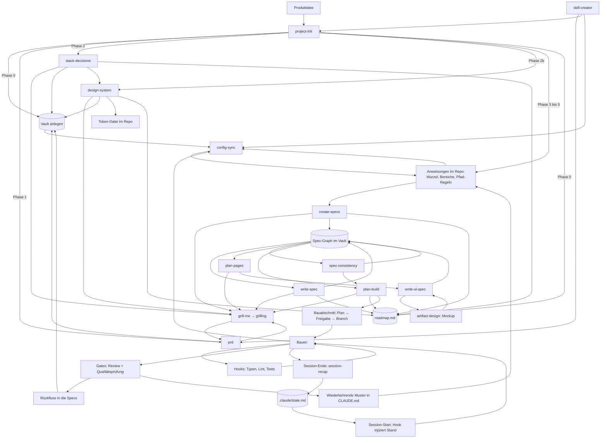

# Der Kreislauf

Wie die Skills zusammenspielen: was wann läuft, was es liest, was es hinterlässt.

Dieses Dokument beschreibt den Mechanismus. Was im Baukasten liegt und wie man es installiert, steht im [README](README.md).

---

## Das Fundament

Ein Projekt hat drei Arten von Wahrheit, und sie altern unterschiedlich schnell.

**Produktwahrheit** (was wir bauen und warum) ändert sich selten und liegt **außerhalb des Repos** im Vault. Nicht an einen Branch gebunden, nicht kopierbar, genau ein Exemplar.

**Arbeitskonventionen** (wie wir hier bauen) ändern sich mit dem Stack und liegen **in der Versionsverwaltung**, direkt neben dem Code, für den sie gelten.

**Ist-Stand** (was der Code heute tatsächlich tut) ist nur verlässlich, wenn er **aus dem Code** gelesen wird. Konfiguration darf ihn nie ohne Beleg behaupten.

Wer diese drei vermischt, bekommt Dokumentation, die verrottet. Sie zu trennen ist der ganze Zweck.

---

## Übersicht

---

## Einmalig, beim Projektstart

Hier läuft **ein** Skill: `project-init`. Er ist der Einstiegspunkt und holt sich die anderen von innen dazu. Die Phasen unten sind seine Phasen, keine getrennten Aufrufe.

### Phase 0: Wissensbasis

Vor allem anderen, auch vor dem PRD. Prüft, ob ein Obsidian-MCP verfügbar ist, führt sonst durch die Einrichtung, und legt die Vault-Struktur an: `PRD.md`, `roadmap.md`, `specs/_index.md`, `specs/decisions/`.

Warum das zuerst kommt: Das PRD braucht einen Ort, bevor es geschrieben wird. Wer es erst erzeugt und danach überlegt, wohin damit, legt es im Repo ab. Dort hängt es an einem Branch, wird irgendwann der Bequemlichkeit halber ein zweites Mal abgelegt, und ein halbes Jahr später widersprechen sich zwei Fassungen und niemand weiß, welche gilt.

### Phase 1: Produkt

Ist ein PRD da, wird es gelesen. Ist keins da, ruft `project-init` den **`prd`**-Skill auf, der wiederum **`grill-me`** zieht, das **`grilling`** ausführt.

`grilling` arbeitet einen Entscheidungsbaum in Runden ab: pro Runde alle Fragen, deren Voraussetzungen geklärt sind, jeweils mit einer Empfehlung. Fakten beschafft der Agent selbst, Entscheidungen trifft der Nutzer. Fertig ist es, wenn keine offene Verzweigung mehr übrig ist.

Ohne dieses Interview wird ein PRD zu dem, was der `prd`-Skill selbst „aspirational fiction" nennt: plausibel klingende Absichten ohne belastbare Aussage.

**Ergebnis:** PRD im Vault, nicht im Repo. Liegt ein vorhandenes PRD woanders, wandert es in den Vault, statt dass eine zweite Fassung entsteht.

### Phase 2: Stack

`project-init` ruft **`stack-decisions`** auf, das sein eigenes Interview über `grill-me` führt und je Entscheidung einen Datensatz in die Wissensbasis schreibt. Getrennt vom Produktgespräch.

Der Grund für die Trennung: Das PRD sagt nichts über die Technik und markiert einen unbestimmten Stack selbst als `TBD`. Regeln für einen Stack, den niemand gewählt hat, lesen sich wie richtige Regeln und werden befolgt. Nur bestätigte Technologie erzeugt technische Regeln, alles andere bleibt `TBD` mit dem Hinweis, was es klären würde.

### Phase 2b: Design-System

Nur wenn das Projekt eine Oberfläche hat. **`design-system`** läuft nach dem Stack, weil das Token-Format davon abhängt, klärt die visuelle Richtung, rendert eine Beispielseite zur Freigabe und schreibt danach zweigeteilt: **Werte in eine Token-Datei im Repo, Begründungen und Regeln in die Wissensbasis.**

Die Zweiteilung ist der Punkt. Ein Farbwert an zwei Orten driftet, und wer dann das Dokument liest, baut das Falsche. Das Dokument trägt nur, was der Code nicht sagen kann: die benannte Richtung, die Prinzipien, die verworfenen Alternativen, und Verbote wie „die Markenfarbe nie als große Fläche".

Freigegeben wird über die Beispielseite, nicht über eine Hex-Tabelle. Eine Palette auf dem Papier sagt nichts darüber, wie sie zusammen aussieht.

### Phasen 3 bis 5: Bereiche, Plan, Schreiben

Bereichskarte aus dem Stack ableiten, Plan vorlegen, nach Freigabe schreiben.

Die erzeugten Anweisungen sind danach getrennt, **wann sie in den Kontext geladen werden**: die Wurzel in jeder Sitzung, eine Bereichsdatei beim Arbeiten in ihrem Verzeichnis, eine Regel mit `paths:` beim Berühren eines passenden Pfads. Eine Regel ohne `paths:` lädt wie die Wurzel, ist also keine eigene Ebene, sondern nur ein anderer Ort für dieselbe Ebene.

**Ergebnis:** Wurzel-`CLAUDE.md`, Bereichs-`CLAUDE.md` je Bereich, `.claude/rules/` mit `paths:`-Frontmatter, und die Wissensbasis-Tabelle, die auf den Vault zeigt.

> **Einzeln aufrufbar bleibt alles trotzdem.** Wer nur ein PRD will, ruft `prd` direkt auf. Wer später eine Technologie tauscht, ruft `stack-decisions` direkt auf, wer ein Redesign macht `design-system`, jeweils ohne den ganzen Projektstart. `project-init` findet vorhandene Ergebnisse und setzt darauf auf, statt neu zu fragen.

---

## Danach: der Spec-Graph

### Zerlegung in Komponenten

**Skill:** `create-specs`

Bricht das Produkt in seine Software-Komponenten auf und legt sie als **verbundenen Graph** an, nicht als Ordner voller Dateien. Ergebnis: ein Index mit jeder geplanten Komponente, ein Platzhalter je Komponente am endgültigen Pfad, und die Schreibreihenfolge aus den Abhängigkeiten.

Der Schnitt ist die kleinere Hälfte. Was den Graph trägt, ist die Regel, dass **jede Komponente ausdrücklich sagt, was sie nicht abdeckt**, und wer stattdessen zuständig ist. Das ist „eine Wahrheit, ein Ort" als Dokumentstruktur. Ohne diesen Abschnitt spezifiziert jede Spec alles halb mit, und zwei Dokumente beschreiben dasselbe Feld unterschiedlich.

Die Grenzen werden **gegrillt, nicht abgeleitet**. Wo zwei Komponenten dieselbe Sache besitzen könnten, gibt es keine allgemein richtige Antwort, und genau deshalb muss sie einmal entschieden und aufgeschrieben werden statt immer wieder anders.

Die Schreibreihenfolge folgt den Verweisen: zuerst, worauf alles zeigt, also in der Regel das Datenmodell, dann die Fachlogik, dann die Verträge, zuletzt die Oberfläche. Wer den Vertrag vor den Feldern schreibt, erfindet Felder.

### Eine Komponente spezifizieren

**Skill:** `write-spec`

Ein Aufruf, ein Dokument, gegen den Code verifiziert statt aus dem Gedächtnis. Vier Prüfungen tragen ihn, und sie sind der eigentliche Wert:

**Ist-Stand nur aus Code, strukturell enumeriert.** Nicht gezielt greppen, sondern die betroffenen Bäume auflisten. Der blinde Fleck ist nie „gesucht und nichts gefunden", sondern „nicht dran gedacht zu suchen".

**Konsistenz-Check auf deklariert-gegen-erzwungen.** Ein Recht, das benutzt, aber nirgends definiert ist, oder umgekehrt tot herumliegt. Namens-Drift. Reste entfernter Features. Findet niemand, der nur fragt, was er neu baut.

**Redundanz-Sweep.** Additionen fallen von selbst auf, Redundanz nicht. Also aktiv fragen, was der Umbau überflüssig, kaputt oder inkonsistent hinterlässt. Mit der Warnung, dass falsch als redundant abstempeln genauso schädlich ist wie übersehen.

**Ripple vorwärts, Reverse-Abgleich rückwärts.** Wen berührt meine Änderung, und wer hat sich schon auf mich verlassen. Der zweite kommt aus einem Scan der eingehenden Links: Späte Komponenten werden referenziert, bevor sie existieren, also tragen die Referenzierenden Erwartungen. Die werden bestätigt oder bewusst gebrochen, nie stillschweigend unterlaufen.

Dazu die Trennschärfe bei offenen Punkten: **jetzt-entscheidbar wird gegrillt, nur-von-anderen-beantwortbar bleibt TBD mit Angabe, wer antworten muss.** Grillen heißt Entscheidungen schärfen, nicht jemanden löchern, wo das Wissen fehlt.

### Seiten planen

**Skill:** `plan-pages`

Je Oberfläche eine Übersicht: Inventar des Ist-Stands mit Pfaden, Navigationsgraph mit markierten rechte-gebundenen Kanten, Befunde ohne Bewertung, und die Ziel-Seitenliste in neu, bleibt mit Anpassungen, gestrichen.

**Abgeleitet aus den Komponenten-Specs, nicht aus dem PRD.** Das PRD sagt, was das Produkt kann; erst die Specs sagen, wie ein Arbeitstag aussieht, und Seiten folgen dem Arbeitstag. Deshalb steht dieser Schritt zwingend nach den Specs.

Der Navigationsgraph ist Pflicht, nicht Schmuck. Er ist das einzige Artefakt, das zeigt, ob eine Seite überhaupt erreichbar ist, und die markierten Kanten machen nebenbei sichtbar, wo Gating fehlt.

### Eine Seite spezifizieren

**Skill:** `write-ui-spec`, ruft `artifact-design`

Ein Aufruf, eine Seite. Der Unterschied zu jeder anderen Spec: eine Seite kann man ansehen, und das Ansehen ändert Entscheidungen. Deshalb entsteht **das Mockup vor dem Dokument**, es wird am Bild iteriert, und das Dokument hält fest, was das Ansehen überlebt hat.

Zwei Regeln machen das Mockup brauchbar: es **übersetzt** den Vorschlag in die Tokens des Design-Systems und erfindet nichts dazu, und es benutzt **echte Beispieldaten** statt Platzhaltertext. Lorem Ipsum verbirgt genau die Probleme, für die ein Mockup da ist: ein umbrechendes Label, eine zu schmale Spalte, eine Zahl, die länger ist als ihr Platz.

Der wertvollste Fund in Phase 1 ist meist ein anderer: **Specs legen UI-Verhalten fest, ohne UI zu sagen.** Sätze wie „keine Vorauswahl bei einem Vorschlag" oder „der Abschlusstext ist Pflicht im selben Schritt wie der Statuswechsel" stehen dort, weil jemand über Korrektheit nachgedacht hat, und werden übersehen, weil sie nicht unter Oberfläche abgelegt sind.

### Den Graph gegen sich selbst prüfen

**Skill:** `spec-consistency`

Findet die Klasse, die das Schreiben einer einzelnen Spec nicht fangen kann: **eine Entscheidung hat sich geändert, nachdem die Specs gegen sie geschrieben wurden.** Das fällt niemandem auf, weil nichts am Schreiben von Spec zwölf jemanden dazu bringt, Spec drei nochmal zu lesen.

**Kein fester Takt, sondern Auslöser.** Eine geänderte Entscheidung, die bestehende Specs zitieren. Ein bewusst gebrochener Annahmebruch, dessen Gegenseite noch offen ist. Ein fertiges Cluster. Und vollständig vor jedem Phasenübergang, der die Specs als Ganzes liest, also vor der Seitenplanung und vor dem Ableiten der Bauphasen. Dazu eine Zahl als Netz, nicht als Mechanismus.

Der Grund: Widersprüche entstehen durch Ändern, nicht durch Schreiben. Ein Lauf nach fünf Specs ohne Umentscheidung sucht eine Fehlerklasse, die es dort nicht gibt; ein Lauf fünf Specs nach einer geänderten Entscheidung findet den Fehler in sechs Dokumenten statt in einem.

**Nicht jeder gegen jeden.** Ein Widerspruch zwischen zwei Specs ist ein Fakt, kein zweiter. Geprüft wird gegen die Invarianten für alle, und paarweise nur entlang der **erklärten** Kanten, jede Kante genau einmal. Gleiche Abdeckung, ein Bruchteil der Last.

**Reiner Bericht, nie ein Fix.** Nachziehen läuft getrennt über `write-spec`, damit die Korrektur dieselben Prüfungen durchläuft wie das Original.

### Die Baureihenfolge ableiten

**Skill:** `plan-build`

Der Übergang vom Spezifizieren zum Bauen. Liest alle Specs auf einmal und schreibt daraus die Bauphasen in den Fahrplan.

**Schreibreihenfolge und Baureihenfolge sind verschiedene Fragen.** Schreibreihenfolge folgt den Verweisen: zuerst, worauf alles zeigt. Baureihenfolge folgt dem Nutzen: was muss existieren, bevor jemand außerhalb des Projekts etwas funktionieren sieht. Die beiden fallen selten zusammen, und keine beantwortet die andere.

Zuerst das **Abhängigkeitsgerüst** aus dem Graph, also die Fakten: was kann vor was nicht gebaut werden, jeweils mit dem Satz, der die Kante erzeugt. Das ergibt eine bewusst unvollständige Ordnung. Sie sagt, was verboten ist, nicht was gut ist.

Die eigentliche Entscheidung liegt in dem, was sie noch offen lässt, und die wird **gegrillt**: innen nach außen, senkrechte Scheiben oder Wedge zuerst. Das hängt daran, wer das erste Ergebnis sieht und wann, ob es Bestand gibt, der abgeschaltet werden muss, und was sonst zweimal gebaut würde. Aus den Specs ist das nicht ableitbar.

**Ein Gate ist eine Liste von Sätzen, die wahr oder falsch sind.** Die Prüffrage: könnte das jemand nachprüfen, der nicht mitgebaut hat? „Datenmodell sauber umgesetzt" fällt durch, „Migration läuft auf frischer und auf Dev-Datenbank durch, Schema-Diff leer" besteht. Zwei bis drei Punkte je Gate beschreiben den Weg eines Menschen durch das Produkt statt den Zustand des Codes; sie sind die, die eine technisch fertige und praktisch unbrauchbare Phase abfangen.

Dazu einmal das **Ritual je Phase**, das ab dann ohne Ausnahme gilt, die **Meilensteine** über die ganze Strecke, der **negative Umfang** und die **Entscheidungstabelle**. Die letzte ist der Teil, der zuerst verloren geht: nach zwei Monaten weiß niemand mehr, warum der Auth-Umbau in Phase 9 liegt, und ohne den Grund verschiebt ihn der Nächste, dem er im Weg ist.

Geschrieben wird das **in den Fahrplan**, nicht in ein zweites Dokument. Der Fahrplan beantwortet bereits, wo das Projekt steht; ein zweites Dokument, das dieselbe Frage genauer beantwortet, liefert zwei Antworten, die auseinanderlaufen.

---

## Je Bauabschnitt

### 4. Planen, freigeben, abzweigen

**Skill:** `planning`

Erst Planungsmodus, dann Plandatei, dann Eintrag im Fahrplan, dann Freigabe, dann Branch. In dieser Reihenfolge. Es wird nichts angefasst, bevor der Plan freigegeben ist, auch der Branch existiert vorher nicht.

Der Fahrplan nennt die **Absicht** der Phase, nicht den Weg. Wird der Weg nicht vorher festgelegt, entsteht er während des Bauens, Entscheidung für Entscheidung, an der Stelle, an der Korrekturen am teuersten sind. Der Planungsmodus erzwingt, dass zuerst gelesen und gefragt wird.

Pflichtabschnitte: Kontext, Ziel, Entscheidungen, kritische Dateien, Reihenfolge, Tests, Verifikation, **Out of Scope**. Der letzte fehlt am häufigsten und ist der, der angrenzende Arbeit draußen hält.

Entscheidungen, die während des Bauens fallen, wandern **sofort** in den Entscheidungsabschnitt der Plandatei, nicht am Ende. Was am Ende nachgetragen wird, ist Rekonstruktion und nicht Protokoll.

### 5. Bauen

**Skill:** `execute-plan`, dazu Hooks nach jeder Dateiänderung

Ein Task nach dem anderen, je Task ein **frischer Subagent**, und nach jedem Task zwei Reviews, bevor der nächste beginnt. Der Koordinator kuratiert Kontext und schreibt selbst keinen Code: Wer selbst implementiert, füllt seinen Kontext mit Detail, das in einen Subagenten gehört, und hat danach niemanden mehr mit Außensicht.

Die beiden Reviews je Task fragen Verschiedenes. **Spec-Treue** prüft, ob genau das gebaut wurde, was der Plan verlangt, und ob etwas gebaut wurde, das er **nicht** verlangt. Der zweite Fall ist der Fund, den sonst niemand macht. **Qualität** prüft erst danach, sonst wird über die Machart von etwas geurteilt, das noch das Falsche tut.

Was der Subagent nicht im Bündel hat, existiert für ihn nicht. Deshalb wird Inhalt eingebettet, nicht auf Pfade verwiesen. Ein Pfad im Prompt ist eine Bitte.

Parallel dazu die Sofortprüfung: Typprüfung und Linter laufen nach jedem Edit, Tests, wenn der geänderte Pfad welche hat. Ein Fehler, der sofort zurückkommt, kostet einen Gedanken. Derselbe Fehler zwanzig Änderungen später kostet eine Suche.

**Tests** folgen `testing`: kein Produktionscode ohne zuerst fehlschlagenden Test, und **Verify Red ist Pflicht**. Wer den Fehlschlag nicht gesehen hat, weiß nicht, ob der Test das Richtige prüft. Welche Fälle Pflicht sind, leitet der Skill aus dem Projekt ab statt aus einem Katalog: aus den Akzeptanzkriterien der Specs, aus den bindenden Regeln der Wurzel und aus den getroffenen Entscheidungen. Ein Verbot, das keinen Test hat, überlebt den, der es beschlossen hat, nicht.

### 6. Abschluss-Gates

**Skill:** `review-changes`

Am Ende eines Abschnitts, in fester Reihenfolge: Checkliste, Tests grün, Änderungsreview, Wartbarkeitsreview, Bericht.

Das Änderungsreview misst **nicht** allgemeine Code-Ästhetik, sondern: Tut der Code, was die Spec sagt, auf die Art, wie dieses Projekt es sonst tut? Es lädt gezielt die Specs der geänderten Pfade und fächert in **drei Linsen** auf, jede mit einem eigenen Kopf: Sicherheit, Spec-Treue, Struktur. Drei Denkweisen; zusammengelegt kostet es Tiefe, weiter aufgeteilt fallen Findings durch die Ritzen.

Zwei Regeln machen den Bericht belastbar. **Nachweis oder es zählt nicht:** zu jedem Finding der Pfad bis zum Schaden, der Gegenbeweis und ein Urteil. Und für die Spec-Linse die Nummer der verletzten Anforderung; ein Spec-Finding ohne Nummer ist eine Meinung. Dazu der **Gate-Abgleich** Punkt für Punkt, und ein Punkt, der ohne laufendes System nicht prüfbar ist, heißt „nicht prüfbar", nie „erfüllt".

Die beiden Reviews sind **getrennte** Gates. Ein sauberes Änderungsreview sagt nichts darüber, ob der Code in sechs Monaten noch zu ändern ist.

Push erst nach ausdrücklicher Freigabe.

### 7. Rückfluss

Was gebaut wurde, wird in die Specs nachgezogen. Das Review liefert die Liste dafür selbst: Es findet regelmäßig Stellen, an denen **die Spec** das Problem ist und nicht der Code, und sammelt sie in einem eigenen Abschnitt „Spec-Rückfluss". Ohne den gehen diese Funde verloren, weil der Bericht sonst nur Code bewertet. Nachgezogen wird über `write-spec`, nicht im Review selbst.

Muster, die im Review **zweimal** aufgetaucht sind, wandern in den Abschnitt für bekannte Schwachstellen der Wurzel-`CLAUDE.md`. Einmal ist ein Vorfall, zweimal ist ein Muster.

Das ist die Stelle, an der aus einem Fehler eine Regel wird. Ohne sie wiederholt sich derselbe Fehler, bis jemand ihn zufällig erinnert.

---

## Je Session

### 8. Zwei Fragen, zwei Dateien

**Wo stehen wir und was kommt als Nächstes** beantwortet der **Fahrplan** (`roadmap.md`) in der Wissensbasis. Er wird in Phase 0 aus `templates/roadmap.md` kopiert, noch bevor das PRD existiert, und trägt den Ablauf dieses Baukastens bereits ausgefüllt: die Schritte, den Skill je Schritt, und die Regeln, die ihn ehrlich halten. Später wachsen die Bauphasen hinein, abgeleitet aus den fertigen Specs. Ein Dokument, zwei Lebensabschnitte eines Projekts, nicht zwei Dokumente.

Gepflegt wird er von den Skills selbst: wer einen Schritt abschließt, trägt ihn ein. Und die Wurzel-`CLAUDE.md` nennt ihn ausdrücklich als **den** Ort für den Status, samt der Pflicht, ihn aktuell zu halten. Beides ist nötig. Ohne den Verweis schaut niemand hin, ohne die Pflicht wird er zum Tagebuch der ersten Woche.

**Was war letzte Sitzung** beantwortet `.claude/state.md` im Repo, geschrieben von `session-recap`.

Beide werden vom SessionStart-Hook **injiziert**, nicht nur erwähnt, samt der Anweisung, die Sitzung mit Standort und Vorschlag zu eröffnen statt auf eine Frage zu warten. Eine Anweisung, eine Datei zu lesen, ist eine Bitte; injizierter Inhalt liegt einfach da. Der Fahrplan lebt außerhalb des Repos, deshalb schreibt `project-init` seinen Pfad beim Installieren nach `.claude/roadmap-path`.

**Er wächst, und ab einer Größe wird nicht mehr alles injiziert.** In der Aufbauphase ist der Fahrplan kurz und geht ganz in die Sitzung. Sobald die Bauphasen darin stehen, passt er nicht mehr: das Referenzprojekt, aus dem dieser Baukasten stammt, hat 65.000 Zeichen. Stumpfes Abschneiden wäre hier der schlimmste Fehlermodus, weil abgeschnittener Inhalt in der Sitzung genauso aussieht wie vollständiger. Deshalb trägt der Kopf die Zeile `**Aktuelle Bauphase:**`, und der Hook injiziert von da an **den Kopf und genau den Abschnitt, dessen Überschrift diesen Text enthält**. Die übrigen Phasen bleiben lesbar, sie liegen nur nicht mehr in jeder Sitzung herum. Der Preis ist eine Zeile, die stimmen muss: zeigt sie auf die falsche Phase, arbeitet die nächste Sitzung mit der falschen Phase, ohne dass etwas fehlschlägt. Sie wird beim Phasenwechsel gesetzt, im selben Zug wie „Jetzt".

Die Trennung ist der Punkt. Der Fahrplan ändert sich selten, die Übergabe jedes Mal. Wer beides mischt, begräbt das Dauerhafte unter dem Flüchtigen. Und der Fahrplan fasst nichts zusammen, was anderen gehört: der Spec-Index besitzt den Status je Spec, der Fahrplan zeigt nur darauf, und beim Widerspruch gewinnt der Index.

Als Nächstes trägt in beiden eine Handlung, keinen Phasennamen. Specs schreiben sagt nichts; zuerst das Datenmodell, alles andere zeigt darauf sagt, wo man anfängt und warum. Genau diese Begründung ist nach ein paar Tagen weg.

---

## Laufend

### 9. Konfiguration gegen die Wirklichkeit

**Skill:** `config-sync` *(fehlt noch, siehe unten)*

Prüft die Konfiguration gegen ihre jeweilige Autorität und zieht Abweichungen nach. Die Zuständigkeit hängt von der Art der Aussage ab:

| Art der Aussage | Zuständig |
|---|---|
| Ist-Stand: „die Funktion heißt X", „das Feld existiert" | **Der Code.** Nachsehen, nie erinnern |
| Entscheidung: „wir nutzen Y nicht mehr" | **Die Entscheidungsdokumente** |
| Produkt: Zielgruppe, Umfang, bewusste Nicht-Ziele | **Das PRD** |
| Verweis nach außen: Vault-Pfad, Werkzeugname, verlinkte Datei | **Das Verwiesene selbst.** Nachsehen, ob es existiert |

Die Prüffrage, wenn unklar ist, welche Autorität greift: *Könnte ich das durch Hinschauen widerlegen?* Wenn ja, wird hingeschaut.

Die vierte Zeile ist die, die am leichtesten vergessen wird, und sie ist teuer. Ein Verweis auf eine Notiz im Vault, auf ein Werkzeug eines MCP-Servers oder auf eine Datei in einer anderen Regel wird beim Schreiben nicht geprüft und altert danach still. Er fällt auch nicht auf, wenn er bricht: die Sitzung sucht, findet nichts, und arbeitet mit weniger weiter, als sie hätte haben können. Wer nur Code, Entscheidungen und Produkt prüft, findet diese Klasse nie, weil sie in keine der drei fällt.

Bei Werkzeugnamen kommt eine Fußangel dazu: es zählt nur, was der **laufende** Server anbietet. Zwei Server können denselben konfigurierten Namen tragen, während nur einer verbunden ist, und ihre Werkzeuge heißen unterschiedlich. Eine Regel, die dann ein Werkzeug vorschreibt, das es auf dem laufenden Server nicht gibt, ist schlimmer als gar keine Regel.

Dieser Schritt schließt den Kreis. Ohne ihn ist alles davor eine Einbahnstraße: Konfiguration entsteht einmal und driftet danach still von dem weg, was tatsächlich gebaut wurde.

### 10. Werkzeuge verbessern

**Skill:** `skill-creator`

Baut neue Skills, verbessert bestehende, misst Trefferquote der Auslöser. Das Werkzeug, mit dem der Baukasten sich selbst erweitert.

---

## Zwei Regeln über allem

**Eine Wahrheit, ein Ort.** Keine Aussage steht in zwei Dateien. Wo eine zweite sie braucht, verweist sie. Zwei Kopien einer Regel werden irgendwann uneins, und dann folgt die Arbeit der falschen.

**Bestand mit Ablaufdatum.** Was noch läuft, aber abgelöst wird, sagt das in seinem eigenen Dokument: was heute gilt, was es ersetzt, welche Entscheidung das festgelegt hat, und worauf nicht mehr aufgebaut werden darf. Dokumentation, die ein sterbendes System als Zielbild beschreibt, bringt jeder Sitzung still das Falsche bei.

---

## Stand des Baukastens

Ehrlich, weil ein Kreislauf mit Lücke kein Kreislauf ist.

| Baustein | Zweck | Stand |
|---|---|---|
| `prd` | Produkt spezifizieren | vorhanden |
| `stack-decisions` | Technische Entscheidungen treffen und festhalten | vorhanden |
| `design-system` | Visuelle Richtung klären, Tokens schreiben, Beispielseite | vorhanden |
| `create-specs` | Produkt in Komponenten zerlegen, Spec-Graph anlegen | vorhanden |
| `write-spec` | Eine Komponente je Aufruf, gegen Code verifiziert | vorhanden |
| `plan-pages` | Je Oberfläche eine Seitenübersicht mit Navigationsgraph | vorhanden |
| `write-ui-spec` | Eine Seite je Aufruf, Mockup vor dem Dokument | vorhanden |
| `spec-consistency` | Den Graph gegeneinander und gegen die Produktwahrheit prüfen | vorhanden |
| `plan-build` | Baureihenfolge mit Gates aus den fertigen Specs ableiten | vorhanden |
| `grill-me` → `grilling` | Interview-Verfahren | vorhanden |
| `project-init` | Konfiguration aufbauen | vorhanden |
| `skill-creator` | Skills bauen und messen | vorhanden |
| `config-sync` | Konfiguration gegen Code korrigieren | **fehlt** |
| Fahrplan als Statusquelle | `templates/roadmap.md`, vorbefüllt, in Phase 0 kopiert | vorhanden |
| Übergabe + Hooks | `.claude/state.md`; Hook injiziert Fahrplan und Übergabe | vorhanden |
| `session-recap` + Hook | Handoff am Sitzungsende, Abschiedsformeln als Auslöser | vorhanden |
| `planning` | Plan je Phase, im Planungsmodus, vor dem Branch | vorhanden |
| `execute-plan` | Plan abarbeiten, frischer Subagent je Task, zwei Reviews dazwischen | vorhanden |
| `testing` | Testdisziplin, Verify Red, Pflichtfälle aus dem Projekt abgeleitet | vorhanden |
| `review-changes` | Gate am Phasenende, drei Linsen, Gate-Abgleich, reiner Bericht | vorhanden |
| Wartbarkeitsreview | Zweites, getrenntes Gate | **fehlt** |
| Weitere Hooks | Sofortprüfung nach Edits | **fehlt** |

Was heute steht, trägt den Weg von der Idee bis zum Ende einer Bauphase. Was fehlt, ist der Rückweg: `config-sync`, der die Konfiguration gegen den gebauten Code korrigiert, das zweite Review-Gate für Wartbarkeit, und die Hooks, die während des Bauens sofort prüfen.
