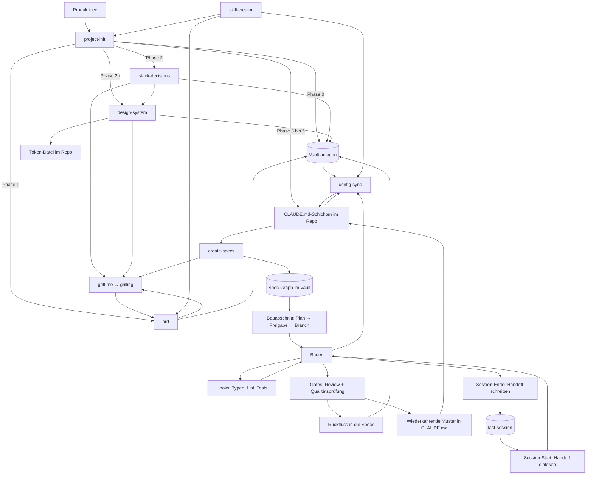

# Der Kreislauf

Wie die Skills zusammenspielen: was wann läuft, was es liest, was es hinterlässt.

Dieses Dokument beschreibt den Mechanismus. Was im Baukasten liegt und wie man es installiert, steht im [README](README.md).

---

## Das Fundament

Ein Projekt hat drei Arten von Wahrheit, und sie altern unterschiedlich schnell.

**Produktwahrheit** (was wir bauen und warum) ändert sich selten und liegt **außerhalb des Repos** im Vault. Nicht an einen Branch gebunden, nicht kopierbar, genau ein Exemplar.

**Arbeitskonventionen** (wie wir hier bauen) ändern sich mit dem Stack und liegen **in der Versionsverwaltung**, direkt neben dem Code, für den sie gelten.

**Ist-Stand** (was der Code heute tatsächlich tut) ist nur verlässlich, wenn er **aus dem Code** gelesen wird. Konfiguration darf ihn nie ohne Beleg behaupten.

Wer diese drei vermischt, bekommt Dokumentation, die verrottet. Sie zu trennen ist der ganze Zweck.

---

## Übersicht

---

## Einmalig, beim Projektstart

Hier läuft **ein** Skill: `project-init`. Er ist der Einstiegspunkt und holt sich die anderen von innen dazu. Die Phasen unten sind seine Phasen, keine getrennten Aufrufe.

### Phase 0: Wissensbasis

Vor allem anderen, auch vor dem PRD. Prüft, ob ein Obsidian-MCP verfügbar ist, führt sonst durch die Einrichtung, und legt die Vault-Struktur an: `PRD.md`, `roadmap.md`, `specs/_index.md`, `specs/decisions/`.

Warum das zuerst kommt: Das PRD braucht einen Ort, bevor es geschrieben wird. Wer es erst erzeugt und danach überlegt, wohin damit, legt es im Repo ab. Dort hängt es an einem Branch, wird irgendwann der Bequemlichkeit halber ein zweites Mal abgelegt, und ein halbes Jahr später widersprechen sich zwei Fassungen und niemand weiß, welche gilt.

### Phase 1: Produkt

Ist ein PRD da, wird es gelesen. Ist keins da, ruft `project-init` den **`prd`**-Skill auf, der wiederum **`grill-me`** zieht, das **`grilling`** ausführt.

`grilling` arbeitet einen Entscheidungsbaum in Runden ab: pro Runde alle Fragen, deren Voraussetzungen geklärt sind, jeweils mit einer Empfehlung. Fakten beschafft der Agent selbst, Entscheidungen trifft der Nutzer. Fertig ist es, wenn keine offene Verzweigung mehr übrig ist.

Ohne dieses Interview wird ein PRD zu dem, was der `prd`-Skill selbst „aspirational fiction" nennt: plausibel klingende Absichten ohne belastbare Aussage.

**Ergebnis:** PRD im Vault, nicht im Repo. Liegt ein vorhandenes PRD woanders, wandert es in den Vault, statt dass eine zweite Fassung entsteht.

### Phase 2: Stack

`project-init` ruft **`stack-decisions`** auf, das sein eigenes Interview über `grill-me` führt und je Entscheidung einen Datensatz in die Wissensbasis schreibt. Getrennt vom Produktgespräch.

Der Grund für die Trennung: Das PRD sagt nichts über die Technik und markiert einen unbestimmten Stack selbst als `TBD`. Regeln für einen Stack, den niemand gewählt hat, lesen sich wie richtige Regeln und werden befolgt. Nur bestätigte Technologie erzeugt technische Regeln, alles andere bleibt `TBD` mit dem Hinweis, was es klären würde.

### Phase 2b: Design-System

Nur wenn das Projekt eine Oberfläche hat. **`design-system`** läuft nach dem Stack, weil das Token-Format davon abhängt, klärt die visuelle Richtung, rendert eine Beispielseite zur Freigabe und schreibt danach zweigeteilt: **Werte in eine Token-Datei im Repo, Begründungen und Regeln in die Wissensbasis.**

Die Zweiteilung ist der Punkt. Ein Farbwert an zwei Orten driftet, und wer dann das Dokument liest, baut das Falsche. Das Dokument trägt nur, was der Code nicht sagen kann: die benannte Richtung, die Prinzipien, die verworfenen Alternativen, und Verbote wie „die Markenfarbe nie als große Fläche".

Freigegeben wird über die Beispielseite, nicht über eine Hex-Tabelle. Eine Palette auf dem Papier sagt nichts darüber, wie sie zusammen aussieht.

### Phasen 3 bis 5: Bereiche, Plan, Schreiben

Bereichskarte aus dem Stack ableiten, Plan vorlegen, nach Freigabe schreiben.

**Ergebnis:** Wurzel-`CLAUDE.md`, Bereichs-`CLAUDE.md` je Bereich, `.claude/rules/` mit `paths:`-Frontmatter, und die Wissensbasis-Tabelle, die auf den Vault zeigt.

> **Einzeln aufrufbar bleibt alles trotzdem.** Wer nur ein PRD will, ruft `prd` direkt auf. Wer später eine Technologie tauscht, ruft `stack-decisions` direkt auf, wer ein Redesign macht `design-system`, jeweils ohne den ganzen Projektstart. `project-init` findet vorhandene Ergebnisse und setzt darauf auf, statt neu zu fragen.

---

## Danach: der Spec-Graph

### Zerlegung in Komponenten

**Skill:** `create-specs`

Bricht das Produkt in seine Software-Komponenten auf und legt sie als **verbundenen Graph** an, nicht als Ordner voller Dateien. Ergebnis: ein Index mit jeder geplanten Komponente, ein Platzhalter je Komponente am endgültigen Pfad, und die Schreibreihenfolge aus den Abhängigkeiten.

Der Schnitt ist die kleinere Hälfte. Was den Graph trägt, ist die Regel, dass **jede Komponente ausdrücklich sagt, was sie nicht abdeckt**, und wer stattdessen zuständig ist. Das ist „eine Wahrheit, ein Ort" als Dokumentstruktur. Ohne diesen Abschnitt spezifiziert jede Spec alles halb mit, und zwei Dokumente beschreiben dasselbe Feld unterschiedlich.

Die Grenzen werden **gegrillt, nicht abgeleitet**. Wo zwei Komponenten dieselbe Sache besitzen könnten, gibt es keine allgemein richtige Antwort, und genau deshalb muss sie einmal entschieden und aufgeschrieben werden statt immer wieder anders.

Die Schreibreihenfolge folgt den Verweisen: zuerst, worauf alles zeigt, also in der Regel das Datenmodell, dann die Fachlogik, dann die Verträge, zuletzt die Oberfläche. Wer den Vertrag vor den Feldern schreibt, erfindet Felder.

*(Noch nicht gebaut: das Schreiben der einzelnen Specs, die Seitenplanung und die UI-Specs, die Konsistenzprüfung über den Graph, und der Bau-Fahrplan aus den fertigen Specs.)*

---

## Je Bauabschnitt

### 4. Planen, freigeben, abzweigen

Erst Planungsmodus, dann Plandatei, dann Eintrag im Fahrplan, dann Freigabe, dann Branch. In dieser Reihenfolge. Es wird nichts angefasst, bevor der Plan freigegeben ist, auch der Branch existiert vorher nicht.

Entscheidungen, die während des Bauens fallen, wandern **sofort** in den Entscheidungsabschnitt der Plandatei, nicht am Ende. Was am Ende nachgetragen wird, ist Rekonstruktion und nicht Protokoll.

### 5. Bauen mit Sofortprüfung

**Mechanismus:** Hooks nach jeder Dateiänderung

Typprüfung und Linter laufen nach jedem Edit, Tests laufen, wenn der geänderte Pfad welche hat. Das Ergebnis landet im selben Arbeitsschritt, nicht in einem Durchlauf danach. Ein Fehler, der sofort zurückkommt, kostet einen Gedanken. Derselbe Fehler zwanzig Änderungen später kostet eine Suche.

### 6. Abschluss-Gates

Am Ende eines Abschnitts, in fester Reihenfolge: Checkliste, Tests grün, Änderungsreview, Wartbarkeitsreview, Bericht. Die beiden Reviews sind **getrennte** Gates. Ein sauberes Änderungsreview sagt nichts darüber, ob der Code in sechs Monaten noch zu ändern ist.

Push erst nach ausdrücklicher Freigabe.

### 7. Rückfluss

Was gebaut wurde, wird in die Specs nachgezogen. Muster, die im Review **zweimal** aufgetaucht sind, wandern in den Abschnitt für bekannte Schwachstellen der Wurzel-`CLAUDE.md`.

Das ist die Stelle, an der aus einem Fehler eine Regel wird. Ohne sie wiederholt sich derselbe Fehler, bis jemand ihn zufällig erinnert.

---

## Je Session

### 8. Übergabe

Am Ende einer Sitzung wird ein Handoff geschrieben, beim Start der nächsten wieder eingelesen. Ausgelöst wird das über Abschiedsphrasen, nicht über einen Befehl, den man sich merken muss.

Der Handoff ist konkret oder wertlos: Branch, Commit-Bereich, Testzahl, was als Nächstes ansteht und in welcher Reihenfolge. „Wir haben an X gearbeitet" hilft niemandem.

---

## Laufend

### 9. Konfiguration gegen die Wirklichkeit

**Skill:** `config-sync` *(fehlt noch, siehe unten)*

Prüft die Konfiguration gegen ihre jeweilige Autorität und zieht Abweichungen nach. Die Zuständigkeit hängt von der Art der Aussage ab:

| Art der Aussage | Zuständig |
|---|---|
| Ist-Stand: „die Funktion heißt X", „das Feld existiert" | **Der Code.** Nachsehen, nie erinnern |
| Entscheidung: „wir nutzen Y nicht mehr" | **Die Entscheidungsdokumente** |
| Produkt: Zielgruppe, Umfang, bewusste Nicht-Ziele | **Das PRD** |
| Verweis nach außen: Vault-Pfad, Werkzeugname, verlinkte Datei | **Das Verwiesene selbst.** Nachsehen, ob es existiert |

Die Prüffrage, wenn unklar ist, welche Autorität greift: *Könnte ich das durch Hinschauen widerlegen?* Wenn ja, wird hingeschaut.

Die vierte Zeile ist die, die am leichtesten vergessen wird, und sie ist teuer. Ein Verweis auf eine Notiz im Vault, auf ein Werkzeug eines MCP-Servers oder auf eine Datei in einer anderen Regel wird beim Schreiben nicht geprüft und altert danach still. Er fällt auch nicht auf, wenn er bricht: die Sitzung sucht, findet nichts, und arbeitet mit weniger weiter, als sie hätte haben können. Wer nur Code, Entscheidungen und Produkt prüft, findet diese Klasse nie, weil sie in keine der drei fällt.

Bei Werkzeugnamen kommt eine Fußangel dazu: es zählt nur, was der **laufende** Server anbietet. Zwei Server können denselben konfigurierten Namen tragen, während nur einer verbunden ist, und ihre Werkzeuge heißen unterschiedlich. Eine Regel, die dann ein Werkzeug vorschreibt, das es auf dem laufenden Server nicht gibt, ist schlimmer als gar keine Regel.

Dieser Schritt schließt den Kreis. Ohne ihn ist alles davor eine Einbahnstraße: Konfiguration entsteht einmal und driftet danach still von dem weg, was tatsächlich gebaut wurde.

### 10. Werkzeuge verbessern

**Skill:** `skill-creator`

Baut neue Skills, verbessert bestehende, misst Trefferquote der Auslöser. Das Werkzeug, mit dem der Baukasten sich selbst erweitert.

---

## Zwei Regeln über allem

**Eine Wahrheit, ein Ort.** Keine Aussage steht in zwei Dateien. Wo eine zweite sie braucht, verweist sie. Zwei Kopien einer Regel werden irgendwann uneins, und dann folgt die Arbeit der falschen.

**Bestand mit Ablaufdatum.** Was noch läuft, aber abgelöst wird, sagt das in seinem eigenen Dokument: was heute gilt, was es ersetzt, welche Entscheidung das festgelegt hat, und worauf nicht mehr aufgebaut werden darf. Dokumentation, die ein sterbendes System als Zielbild beschreibt, bringt jeder Sitzung still das Falsche bei.

---

## Stand des Baukastens

Ehrlich, weil ein Kreislauf mit Lücke kein Kreislauf ist.

| Baustein | Zweck | Stand |
|---|---|---|
| `prd` | Produkt spezifizieren | vorhanden |
| `stack-decisions` | Technische Entscheidungen treffen und festhalten | vorhanden |
| `design-system` | Visuelle Richtung klären, Tokens schreiben, Beispielseite | vorhanden |
| `create-specs` | Produkt in Komponenten zerlegen, Spec-Graph anlegen | vorhanden |
| Specs schreiben | Eine Komponente je Aufruf, gegen Code verifiziert | **fehlt** |
| Seitenplanung + UI-Specs | Welche Seiten es gibt, dann je Seite eine Spec mit Mockup | **fehlt** |
| Spec-Konsistenz | Den Graph gegeneinander und gegen das PRD prüfen | **fehlt** |
| Bau-Fahrplan | Reihenfolge mit Gates aus den fertigen Specs ableiten | **fehlt** |
| `grill-me` → `grilling` | Interview-Verfahren | vorhanden |
| `project-init` | Konfiguration aufbauen | vorhanden |
| `skill-creator` | Skills bauen und messen | vorhanden |
| `config-sync` | Konfiguration gegen Code korrigieren | **fehlt** |
| Session-Übergabe | Handoff schreiben und einlesen | **fehlt** |
| Änderungsreview | Gate vor dem Commit | **fehlt** |
| Projektstand | offene Arbeit beantworten | **fehlt** |
| Hooks | Sofortprüfung, Phrasen-Routing | **fehlt** |

Was heute steht, trägt die Schritte 1 bis 3: von der Idee zum Gerüst. Alles danach ist beschrieben, aber noch nicht gebaut.
